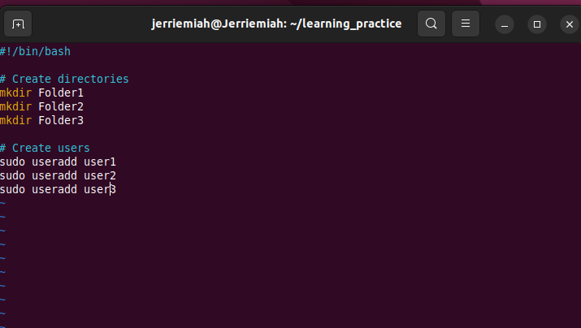
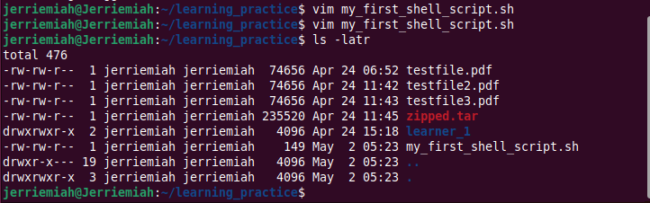
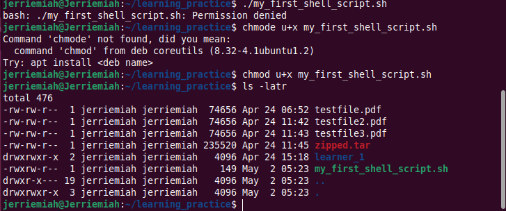
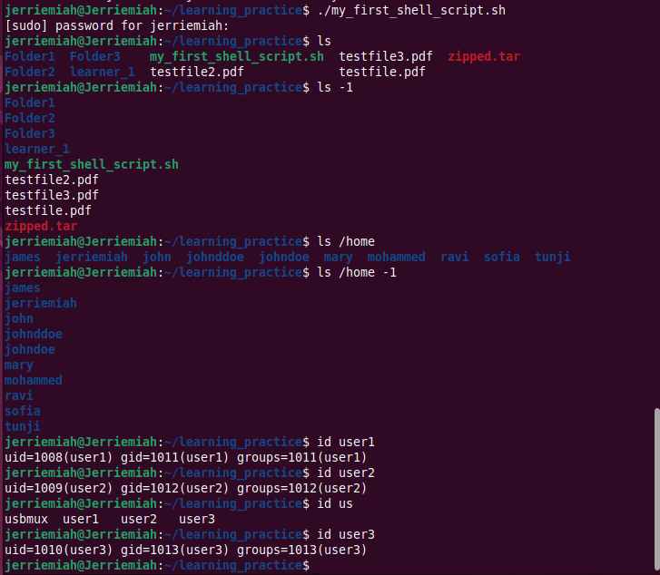
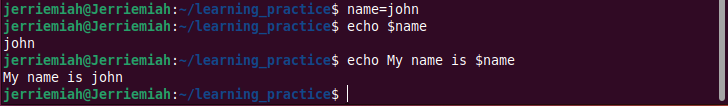
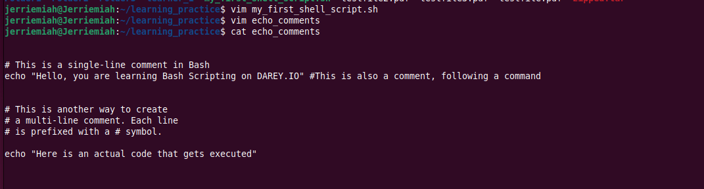
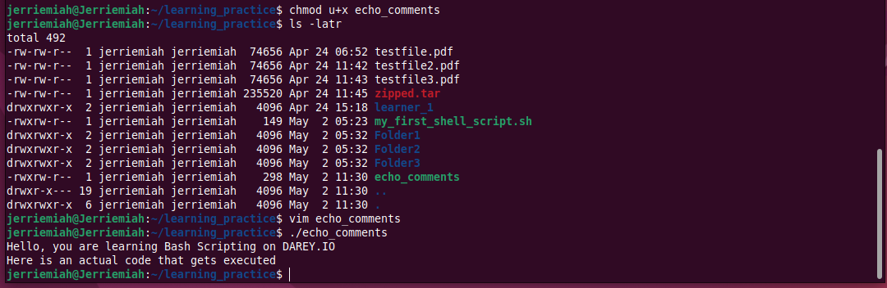

# linux_shell_scripting_mini
This project included practice for shell scripting and creating variables
# **Linux Shell Scripting Automation Project**

## **Introduction**
Shell scripting is used to automate repetitive tasks in Linux by executing multiple commands sequentially within a script. It enhances efficiency in system administration and task automation.

## **Task Overview**
I created a **bash script** named `my_first_shell_script.sh` using Vim as the instructor instructed. The script performs the following operations:
- Creates **three directories**: `folder1`, `folder2`, `folder3`.
- Adds **three users**: `user1`, `user2`, `user3`.

## **Execution Process**
1. **Ran the script** but encountered a **permission denied error**.
2. **Updated the permissions** to allow execution.
3. **Successfully executed the script** after changing permissions.
4. Used `ls` to confirm **directories were created**.
5. Used `id` to verify **users were created**.

## **Shebang Explanation**
The script begins with `#!/bin/bash`, known as a **shebang**. This line tells the system to use the Bash shell to execute the script.

## **Using Variables**
A variable stores data for reuse. In my script, I defined a variable:
```bash
name="john"
```
The variable `name` holds the value `"john"`.

I used `echo` command to call the variable and it printed its value

## **Comment Explanation**
Comments are lines of codes that are ignore by the interpreter. 
 In Bash scripts, comment help document the purpose of a code, making it easier for others (and myself) to follow and understand the script's functionality.

 I Created a script using *vim* called `echo_comments` and ran the scipt to demonstrate how comments work.
 

## **Screenshots**
Screenshots of all commands used have been included at below.


#

#

#

#

#

#
