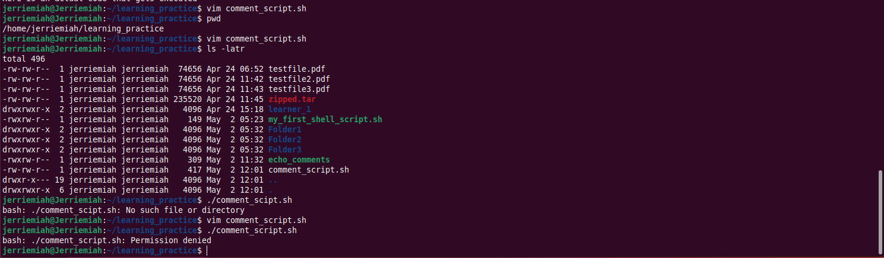
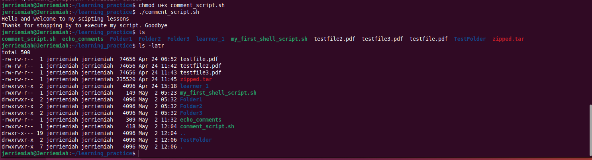

# linux_shell_scripting_mini
This project included practice for shell scripting 
# **Linux Shell Scripting Automation Project**

## **Introduction**
Shell scripting is used to automate repetitive tasks in Linux by executing multiple commands sequentially within a script. It enhances efficiency in system administration and task automation.

## **Task Overview**
I created a **bash script** named `my_first_shell_script.sh` using Vim as the instructor instructed. The script performs the following operations:
- Creates **three directories**: `folder1`, `folder2`, `folder3`.
- Adds **three users**: `user1`, `user2`, `user3`.

## **Execution Process**
1. **Ran the script** but encountered a **permission denied error**.
2. **Updated the permissions** to allow execution.
3. **Successfully executed the script** after changing permissions.
4. Used `ls` to confirm **directories were created**.
5. Used `id` to verify **users were created**.

## **Shebang Explanation**
The script begins with `#!/bin/bash`, known as a **shebang**. This line tells the system to use the Bash shell to execute the script.

## **Using Variables**
A variable stores data for reuse. In my script, I defined a variable:
```bash
name="john"
```
The variable `name` holds the value `"john"`.

I used `echo` command to call the variable and it printed its value

##

# **Commented Shell Script Project**

## **Objective**
Here I implemented the instructor's requirement of writing a **commented shell script (`commented_script.sh`)** that automates basic system tasks while including inline explanations.

## **Implemented Features**
- **Welcome Message**: The script begins with a `echo` command displaying a greeting.
- **Directory Creation**: Automatically creates a folder named `TestFolder`.
- **File Listing**: Uses `ls` to display files inside `TestFolder`.
- **Goodbye Message**: Ends the script with a farewell message.
- **Inline Comments**: Each step is explained using `#` comments for clarity.

## **Execution Details**
1. **Created and wrote the script using Vim (`commented_script.sh`).**
2. **Attempted execution but faced permission errors.**
3. **Resolved permissions** to allow execution (`chmod +x commented_script.sh`).
4. **Ran the script successfully**, verifying that:
   - `TestFolder` was created (`ls` command output confirmed).
   - Messages appeared correctly.
   - File listing worked as expected.

## **Screenshots**
Screenshots of all execution steps and commands have been included.


#

#

#

#

#

#
